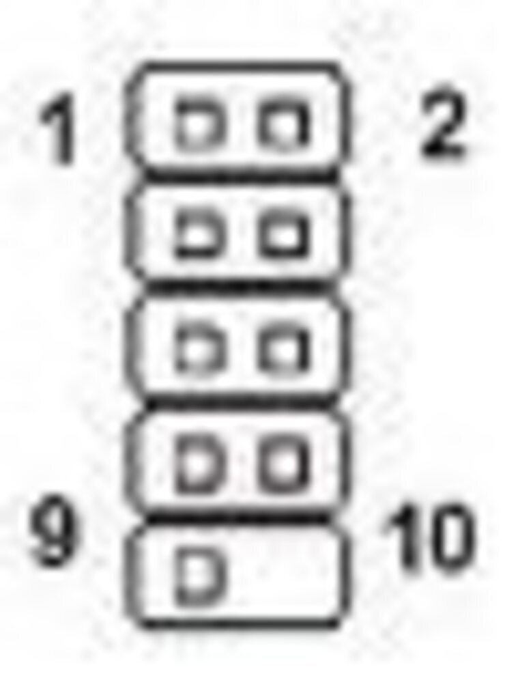

## Background

So this was me when i first got the motherboard:

> Got a Blitz formula today and i thought all was well plugged in the 24pin ATX and EATX power and all the lights were on (good stuff) Clicked the on button, the LCD was stuck with CPU INIT, I've tried clearing CMOS everything I don't know what the hell is wrong, currently in the process of resetting the CMOS (press CLR_CMOS button and take out the battery for 2 hours). The board is spotless, absolutely perfect, all the lights come on and even when you install the GPU wrong the little warning light comes on but it will not POST, just says CPU INIT all the time and restarts every 3/4 seconds as if there was a bad overclock and it was resetting to default.

As you can see something was obviously up with it and as it wouldn't even POST i couldn't flash the BIOS. So I looked for alternate methods and there were 2 open to me:

* De/Re-Solder the BIOS chip with a new one
* Work out how to flash using the SPI Port and flash from another computer (or in my case a very old laptop with an LPT port on it)

So naturally I chose the latter, but the next challenge was to find out how I go about using this SPI port (which looks very similar to a USB header).

## You will need

* Broken Motherboard
* Spare PSU
* Paperclip
* Laptop/Desktop with LPT/Serial
* 100 Ohm Resistors (x4)
* An old unused cable with a 2*5 header on one end
* [Universal Boot CD v4.1.1 (Version Important)](https://archive.org/details/ubcd411)
* [SPIPGM](http://rayer.ic.cz/programm/spipgm.zip)
* [CWSDPMI7](http://rayer.g6.cz/programm/cwsdpmi7.zip) (Copy contents of /bin folder to the same directory as SPIPGM2)
* [Cable Wiring Guide](http://www.yourbrainiacs.com/FILES/ReflashBIOS.doc)
* A BIOS ROM for your motherboard (download the latest)
* Basic DOS knowledge

## Method

First things first, you want to download the 3 files (The Boot CD .iso, `SPIPGM` (Used to flash the ROM), `CWSDPMI7` (DPMI host process needed by `SPIPGM`)).

Burn the Universal Boot to a CD, place both `SPIPGM` and `CWSDPMI7`'s `/bin` files as well as the BIOS ROM in the `C:` directory on your laptop/desktop that you will be doing the flashing from. Butcher up the header cable (i.e. take off the outer sleeving so all you are left with is the header that will connect to the SPI Port and about 1M of wires.

The guide to creating this cable is detailed [here](http://www.yourbrainiacs.com/FILES/ReflashBIOS.doc), note it is VERY important to use the 3V line from the spare PSU (to hot-wire the spare PSU use the paperclip and make a connection between the green wire and ANY black wire) and NOT 2x `AA` batteries as 2x `AA`'s will not work (believe me I've tried), also ignore the bootable USB as were using a CD.

Once you have created the flashing cable then it is time to plug it into the Serial Port on your chosen flashing computer (Make sure it's mode is set to LPT port as detailed in the pdf, check and recheck these!) The ports should be as so:

| LPT Port | SPI Port |
|  :----:  |  :----:  |
| 7        | 3        |
| 8        | 4        |
| 9        | 6        |
| 10       | 5        |
| 18       | 2        |
| DB25 (LPT Port Pinout) |     SPI Port Pinout    |
|||

Once you have everything hooked up and triple checked (don't forget to hook up port 1 to +3V and 2 (that is also connected to 18 on the LPT) to 0V), then it's time to shut down your laptop/desktop that you wish to flash from and change the BIOS to boot from CD, restart again and boot into the CD.

**(BEFORE BOOTING MAKE SURE PARALLEL PORT IS SET TO LPT/378h IN BIOS!)** 

Once in the CD select a program called `_NTFS4DOS` (In `File System->NTFS Tools->Avira NTFS4DOS`) This will give you access to your `C:` drive where you saved the `CWSDPMI7` and `SPIPGM` and your BIOS's ROM earlier. Once there the next thing to do is execute this from the DOS cmd line:

```bash
SPIPGM2 /d DUMP.ROM
```

This dumps the ROM to a file in `C:` called `DUMP.ROM` To analyze your dumped ROM upload `DUMP.ROM` to here:

<http://www.fileformat.info/tool/hexdump.htm>

Select to 10000 characters Compare this to the first 10000 characters of the downloaded ROM (upload this via the same method).

Next you have to flash the ROM do this by executing these commands in DOS:

```bash
CWSDPMI
SPIPGM2 /i
SPIPGM2 /u
SPIPGM2 /e
SPIPGM2 /s BIOSNAME.rom
```

And your done! Maybe one last ROM dump to make sure all has gone to plan and boot your broken mobo up!

Credit to:

* <http://www.fccps.cz/download/adv/frr/spi/msi_spi.html>
* <http://rayer.ic.cz/elektro/spipgm.htm>
* <http://mondotech.blogspot.com/2009/05/asus-p5b-deluxe-bios-recovery-spi-flash.html>

Any problems/error codes leave a comment and I'll do all i can to help! Just covering my ass: By carrying out these actions your are individually and solely responsible for anything that may/may not happen to your motherboard/other devices.

Why not follow [@mylesagray on Twitter][2] for more like this!

 [1]: images/asus-p5b-deluxe-bios-recovery-spi-flash.html
 [2]: https://twitter.com/mylesagray