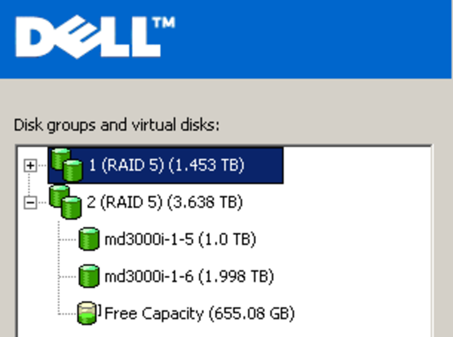
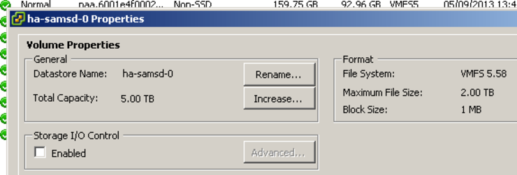

I have had the need recently to expand a LUN on a Dell MD3000i SAN to above 2TB that is presented to VMWare ESX 5.1 hosts. 

There are a few caveats here:

* The VMWare datastore for 2TB+ LUNs _must_ be VMFS-5 as it is now GPT based, not MBR.
* This can be updated on the fly without shutting down VMs
  * **(Configuration -> Storage, Click the Datastore -> "Upgrade to VMFS-5")**
* Expanding the virtual disks on MD3000i's can only be done in CLI.

First, add your new physical disks to the box and add them to the appropriate RAID volume group. Next, you will be presented your space as "Free Capacity" - copy down the size of this in GB.



On the computer running MD Storage Manager open cmd and navigate to `C:\Program Files\Dell\MD Storage Manager\Client`

The command you need to run is:

```powershell
SMCli.exe [your.san.ip.address] -c "set VirtualDisk ["[VDNAME]"] addCapacity=XXXXXXXXXX;" -p [password]
```

Of course, replace the `[your.san.ip.address]`, `[password]`, `[VDNAME]` (of the disk you wish to expand) and XXXXXXXXX capacity (in Bytes) to those appropriate to you. You'll see the following output if the command runs successfully:

```txt
    Performing syntax check...
    
    Syntax check complete.
    
    Executing script...
    
    Script execution complete.
    
    SMcli completed successfully.
```

You can then watch your initialisation progress with (follow same replacements as above):

```powershell
SMCli.exe [your.san.ip.address] -c "show VirtualDisk ["[VDNAME]"] actionprogress;" -p [password]
```

N.B: _Sorry to all my linux friends - Dell don't let you SSH into the box - you'll have to use a VM :(_

You can then go back to VSphere Client and choose your datastore - **Right click, Properties -> Increase  -> Choose the LUN** you just expanded, expand VMFS to maximum size available, Finish, your datastore is now expanded.



All the above can be done on a live system - though due to the I/O from the volume initialization and inherent risks make sure you have backups and that you do this after hours ;)

Why not follow [@mylesagray on Twitter][2] for more like this!

 [2]: https://twitter.com/mylesagray