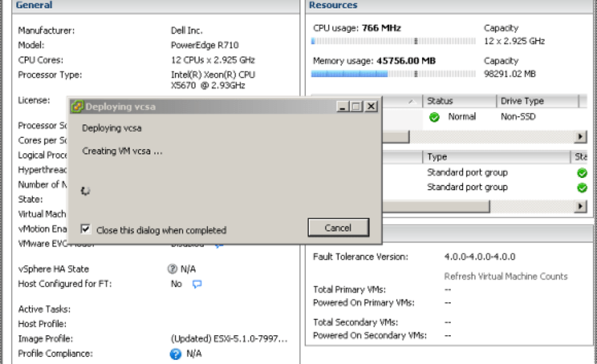
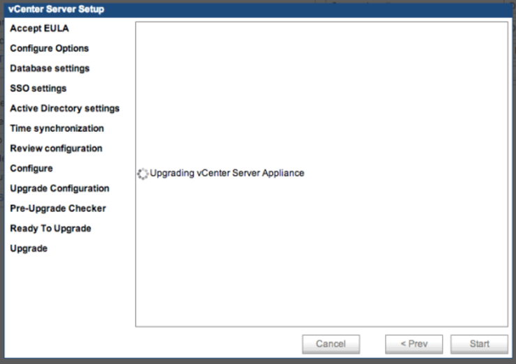

So [you've downloaded all the new VMWare 5.5 goodies][1] and you want to upgrade your vCSA install to v5.5 - this is a little more involved than you may think, however it is very much worth the effort:

> In vSphere 5.5, the vCenter Server Appliance limitations have been extremely raised when using the embedded database:
> _Previous to vSphere 5.5, the limits were:_
>
>* 5 vSphere Hosts
>* 50 Virtual Machines

With vSphere 5.5, the limits are now:

>* 400 vSphere Hosts
>* 4000 Virtual Machines

Referenced article: <http://kb.vmware.com/kb/2057376> Original reports denoted 500 vSphere Hosts and 5000 Virtual Machines.

**[A tweet Justin King][5]** mentioned a 100/3000 limit:



In short the vCenter Server Appliance now has the horsepower to run in many, if not most vSphere Environments – even in the Fed space.

And if that wasn't enough incentive there are [all the updates][6] that are included in vSphere Web Client (a total overview with [this quick reference][7] is good to look at):

* [Console is now HTML5][8]
* Web Client is now completely platform agnostic - Mac OSX FTW!
* SSO greatly improved
* Recently visited & created objects
* vSphere Inventory Navigator History
* Deploy vCenter Operations from vSphere Web Client

Alright so now that we're all psyched to upgrade to vCSA 5.5, lets get to it ([very useful KB article][9])! [Download the vCSA 5.5 .ova][10]

Deploy this to your cluster/host/whatever (with all default settings). (`File -> Deploy OVF Template`)

[Deploying vCSA v5.5](images/Screen-Shot-2013-09-23-at-22.26.55.png)

Goto the IP address of your newly deployed vcsa instance and `Accept the EULA, click Next, select Upgrade from previous version`.

Copy the key from the new appliance, into the `Upgrade` section of the old appliance and click `Import remote key`. Copy the upgrade key out of the old appliance and paste it into the `Paste source appliance key` section and `click Next`. `Check replace SSL certificates`.

Add the password for the new vcsa appliance and continue through all the prompts, view the list of hosts presented by the vcsa appliance and ensure the ones you want that vcsa instance to manage are checked. Make sure you've backed up or snapshotted your vcsa instance and continue through the pre-upgrade checker then click `upgrade`.

The new appliance shuts down the old appliance and assumes the network identity of the old appliance. If the old appliance was configured to use dynamic addressing, the new appliance will also use dynamic addressing. When the import is complete, the new vCenter Server Appliance starts.

`Click close` and the vcsa appliance will reboot.

You're done - your new vcsa appliance has taken the network identity on of the old one and all it's parameters (you may need to confirm some SSL cert changes for the likes of VUM, vSphere Desktop Client etc).

 

Why not follow [@mylesagray on Twitter][11] for more like this!

 [1]: https://www.yellow-bricks.com/2013/09/22/start-engines-time-download-vsphere-5-5/
 [5]: https://twitter.com/VxJustinKing/status/375708181537619969
 [6]: https://onix.kiev.ua/download/vmware/VMware-vSphere-5.5-Platform-Whats-New.pdf
 [7]: https://blogs.vmware.com/vsphere/files/2013/09/vSphere-5.5-Quick-Reference-0.5.pdf
 [8]: https://www.youtube.com/watch?v=M7XQ08KD-fg
 [9]: https://docs.vmware.com/en/VMware-vSphere/6.0/com.vmware.vsphere.upgrade.doc/GUID-6A5C596D-103E-4024-9353-5569263EB427.html
 [10]: https://customerconnect.vmware.com/downloads/details?downloadGroup=VC55U3K&productId=353&rPId=35248
 [11]: https://twitter.com/mylesagray