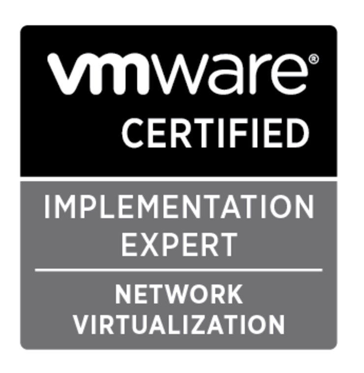

I've been putting off doing VCAP level exams for a long time, probably longer than I should have in hind-sight. But a month ago I took my brave pills and booked what would be my first VCAP level exam: [VCIX6-NV][1]. So the date was set and I have been studying in pretty much all the free time I have over the last month - repeating HOLs over and over, standing up, breaking, fixing my home lab's NSX environment, setting all kinds of stuff with API instead of the UI to try and get a grasp of everything this exam is supposed to encompass.

I'll start with studying, follow the blueprint - it is absolutely essential and will prepare you for (almost) everything this exam throws at you, follow one of the blueprint guides, I used Martijn Smit's [excellent one][2] - be aware it was written in 2014 and is not fully up to date with VCIX6-NV, but it very close - I used this guide step by step and went and implemented everything that was described in my lab.

This leads me on to step two - if you don't have a [home lab][3] or a [dedicated environment][4] for testing in, I believe it will be very hard to pass this exam, even rent one from baremetal cloud I linked to before. It also helps to have a use case: mine is the services for my apartment and parent's home runs inside this lab which gave me the perfect use case for NSX, multi-tenancy and some live workloads to experiment with, a snippet of my DLRs, Edges and Logical Switches can be seen below.

![Home lab NSX Edges][5]

It helps that above, each of the ESGs and DLRs has a different config, some run OSPF, some static, some BGP between each other, the Kharms-DLR for example has some bridging interfaces there to transmit client data onto a shared subnet with servers (the kit is actually hosted in that premises).

![NSX Logical Switches][6]

If you don't have use cases, make some up, build a few workload you sort-of care about so you are motivated to fix rather than just blow away and start again, it will also help you experience edge cases (I had a few load-balancer WTF moments the night before the exam!).

I'm assuming you have a VCP6-NV and followed some online courses like [Jason Nash][7]'s [PluralSight course][8] for that - but this exam being 100% live lab based, the best experience you can get is to actually _use_ the product.

That nicely leads me on to my third piece of advise for studying, _do the HOLs_ _lots_.

Ones I'd particularly recommend:

* [HOL-1703-SDC-1 - VMware NSX: Introduction and Feature Tour][9]
* [HOL-1703-USE-2 - VMware NSX: Distributed Firewall with Micro-Segmentation][10]
* [HOL-1703-USE-3 - VMware NSX: Operations and Visibility][11]

and if they're still available:

* [HOL-SDC-1603 VMware NSX Introduction][12]
* [HOL-SDC-1625 VMware NSX Advanced][13]

I covered the above labs between 5-10 times each. They are invaluable and are very close to the exam experience of which you can [get a look at here][14].

Moving on to taking the exam itself, if you want more info on the environment, take a look at the blogs by [Joshua Andrews][15] and [Dave Davis][16] - take note in particular the keys that are disabled and that you _have no right click_ so don't click on a VM console session :)

The exam time is 190 minutes, which sounds like a lot - _it's not_. This exam is grim and a god damn time vortex, I got hung up on Q2 after the browser cache didn't clear and ended up rebooting an NSX manager to try and alleviate the problem - which worked, but it was time wasted. I also encountered a problem where two questions seemed to contradict each other, but it was me being panicked, I didn't see it - don't get lost in the beginning, note down questions you aren't 100% confident with and come back to them.

Set yourself a pace per question, like you would with any exam, 190 minutes and 23 questions = 8.2 minutes per question. I did find myself at the end with 30 minutes left and 8 questions to go, rushing through trying to make up for lost time and didn't end up answering everything, but that appears to be the grim truth of VCAP level exams - I later found out on the vExpert Slack team this is the rule rather than the exception.

But the stress, leaving out questions at the end because of lack of time and overall dread felt during the exam resulted in this:



However, less than an hour later and a very hasty + angry drive home, I found this in my inbox...



That I did not expect, I almost didn't want to open the attachment for fear of it driving home the truth that I had failed, however, my pessimism appeared to be redundant and I can now proudly call myself [a VCIX][17]! :)

If you want a few more resources on exam experiences, [Anthony Spiteri][18] and [Ross Wynne][19] have both written about the VCIX-NV in a similar manner.

Why not follow [@mylesagray on Twitter][20] for more like this!

 [1]: https://mylearn.vmware.com/mgrReg/plan.cfm?plan=89128&ui=www_cert
 [2]: http://lostdomain.org/vcix-nv-study-guide/
 [3]: /hardware/my-home-datacenter/
 [4]: https://www.baremetalcloud.com/
 [5]: images/Image-10.png
 [6]: images/Image-11.png
 [7]: https://twitter.com/TheJasonNash
 [8]: https://www.pluralsight.com/courses/vmware-nsx-vsphere-network-services
 [9]: http://labs.hol.vmware.com/HOL/catalogs/lab/2750
 [10]: http://labs.hol.vmware.com/HOL/catalogs/lab/2751
 [11]: http://labs.hol.vmware.com/HOL/catalogs/lab/2752
 [12]: http://labs.hol.vmware.com/HOL/catalogs/lab/2125
 [13]: http://labs.hol.vmware.com/HOL/catalogs/lab/2102
 [14]: https://mylearn.vmware.com/lcms/web/portals/certification/VMware%20Certification%20Platform%20Interface.pdf
 [15]: http://sostechblog.com/2016/06/16/current-vcix6-nvvcix-nv-exam-environment/
 [16]: http://www.virtualizestuff.com/2016/08/02/vcap6-exam-interface-tips-tricks/
 [17]: http://blogs.vmware.com/education/2016/04/where-in-the-world-are-vcaps-infographic.html
 [18]: http://anthonyspiteri.net/?s=vcix
 [19]: http://www.wynner.eu/computing/my-vcix-nv-exam-experience/
 [20]: https://twitter.com/mylesagray
