## Introduction

All I wanted to do was move my gaming rig from Windows to Linux, now I've contributed a fix to Wine.

Obviously there is more to it than that, Valve (via the SteamDeck) have financed and made possible the running of a whole chadre of games and applications that are Windows native, on Linux. Through Proton and Wine, in turn, they made it possible for me to move my gaming PC (and my music production rig, to a lesser extend) from Windows and MacOS to Linux.

The problem is, my sim rig has taken years to build, and looks like this...

[Sim-Rig]()

Thats a lot of very cusom, very niche, USB and serial devices - all of which their own separate applications (Windows only, ofc) that manage configuration, firmware updates, even API exposure to other applications like the games and simulators that I run.

Shockingly (or maybe not), for the most-part they were discovered and operable in Linux OOTB, that is to say nothing of the applications that drive and configure them however.

Over time, I have gradually whittled away at the apps that I need to run these things until I get to the one remaining sore thumb in all this.

The keen-eyed of you may notice the four vertical black extrusions on each corner of the rig with what look like CNC motors on top of them. What a coincidence, They _are_ CNC motors! What do they do? Well, they make the entire rig move, like this:

[Sim-Rig moving]()

## The Problem

On Windows this is a tenuous and involved enough process, there are a number of components involved in making such a system work. It looks something like this:

```
|      |  Telemetry  |          |  Serial Data  |            |  PWM + Power  |       |
| Game | ----------> |  Motion  | ------------> |   Motion   | ------------> | Motor | == Rig go up/down
|      |             | Software |               | Controller |               |       |
```

The steps we're mostly concerned with here are the `Telemetry` and `Serial Data` as the OS is involved in both of those steps.

### Telemetry

There is no "standard" API for the `Motion Software` (we could use anything; [SimHub](https://www.simhubdash.com/), [FlyPT Mover](https://www.flyptmover.com/home), [SimRacingStudio](https://www.simracingstudio.com/), whatever) to scrape data from whatever game you are playing to allow you to model, or use a profile to define how the rig reacts to that metric.

Some applications have nice SDKs and APIs (like MS Flight Sim), others need to rely on IPC, others output data to a csv file that is read by the `Motion software`, others yet need to have a shared memory area scraped (ick!).

As you can see, the `Motion software` needs to run on the same kernel really as the game that is being run. That means, our motion control software can't run on a Windows box remotely and take commands from some agent - so we need to make it run in Wine.

### Serial Data

This is where the fun really starts, Wine does indeed have support for serial devices, serial over USB, whatever, and has for some time - you can take arbitrary `/dev/tty[ASU]` devices and [map them through to `COM` ports in Wine](https://wiki.winehq.org/Wine_User%27s_Guide#Serial_and_Parallel_Ports).

In fact - it does this for you automatically today, all serial devices are by-default mapped through into your Wine prefixes (prefixes are things that create separate "environments" for your Windows apps to live in with their dependencies, like Pyhton `venv`).

So, this is all good news! As long as we can make the app run in Wine with the right set of dependencies installed and chickens sacrificed, we will have a working motion rig in no time... [foreshadowing]

### Trying it out

#### SimHub

So, to set the bar high, I installed [SimHub](https://www.simhubdash.com/) in a new Wine prefix with its pre-reqs, enabled the motion module, took the measurements of my rig and put it all together.

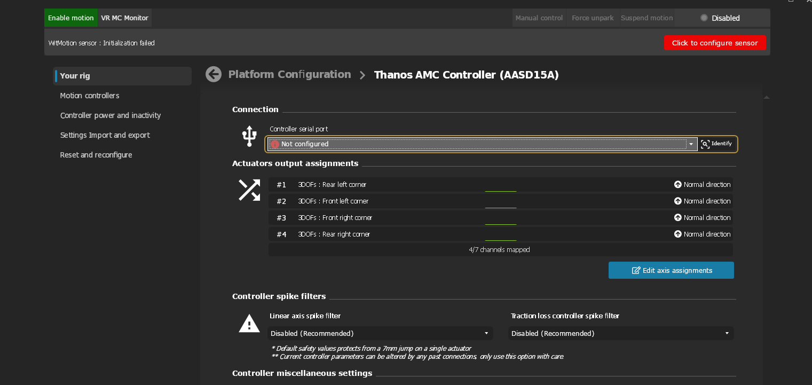

Hmm, the motion modules isn't detecting, or seeing my motion controller device (a Thanos AMC-AASD). No problem, SimHub also has a "Custom Serial Devices" module that I can use to see if the software is getting data from the serial port.

I set up the custom serial section with the correctly mapped COM port from Wine, the baud rate for my device (`250000` - we will be revisiting this) and the appropriate modes and turned it on.

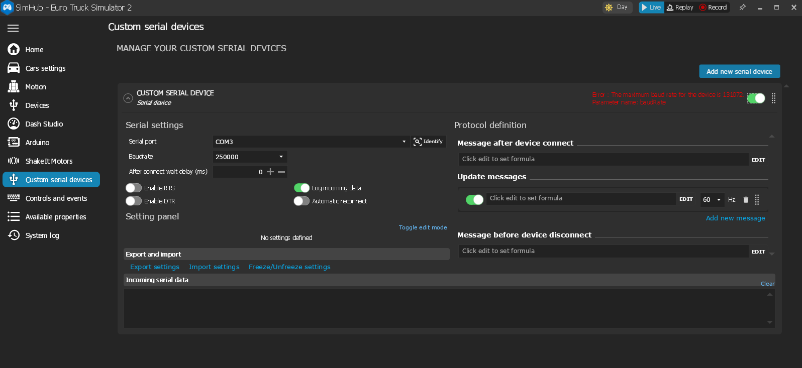

Okay, so, that's not gone well - and even stranger - that baud rate `131072` feels _extremely_ specific.

## The Archaeology

At this point I wasn't sure was my serial port not working correctly, maybe my controller was busted, maybe Linux assigned it the wrong `VID` and `PID` and it was being filtered out, maybe the USB was negotiating the wrong baud rate, maybe the conversion from `/dev/ttyUSB0` to `COM1` in Wine was breaking something. I needed less variables.

Let's prove the port can actually be communicated with.

I installed `picocom` on my Arch distro and ran a simple command and [sent the controller a `CMD55`](https://github.com/tronicgr/AMC-AASD15A-Firmware/blob/master/Manual-and-Datasheets/User_Manual_v2_9-AMC-AASD15A_4DOF%2BTL%2BSurge-SRS-Simtools.pdf) which should print out all the settings on the controller which it did just fine:

```sh
❯ picocom -b 250000 /dev/ttyUSB0
picocom v3.1

port is        : /dev/ttyUSB0
flowcontrol    : none
baudrate is    : 250000
parity is      : none
databits are   : 8
stopbits are   : 1
escape is      : C-a
local echo is  : no
noinit is      : no
noreset is     : no
hangup is      : no
nolock is      : no
send_cmd is    : sz -vv
receive_cmd is : rz -vv -E
imap is        : 
omap is        : 
emap is        : crcrlf,delbs,
logfile is     : none
initstring     : none
exit_after is  : not set
exit is        : no

Type [C-a] [C-h] to see available commands
Terminal ready
data:v2.26:AASD:4:0:7:6:127:24:5:1:0:1:23:157:2:2:1:0:0:157:2:0:0:0:3:

Terminating...
Thanks for using picocom
```

So, the serial port works, at the default settings in Linux - now i'm convinced something is wrong translating this to Wine. I even checked the [FTDI_SIO driver code in the Linux kernel](https://github.com/torvalds/linux/blob/c03e9c42ae8f9be76a0cf55ef3f88663f0f6a63a/drivers/usb/serial/ftdi_sio.c#L1306-L1318) for my device to see that the baud was acceptable - and all good.

### PuTTY

What's the simplest app I can use in Wine that would prove I can still communicate with the serial port? Ye-olde `PuTTY.exe`.

10 seconds later I send it the same `CMD55` at `250000` baud:

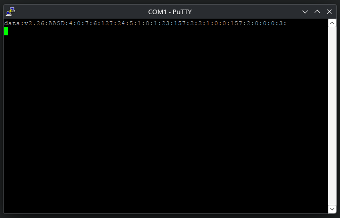

Well, shit.

Maybe my motion software has some weird arcane API usage that just won't work in Wine yet?

We need a simpler app - but one that will still talk to the controller. Handily - the Thanos controller has an [`AMC_Config.exe`](https://github.com/tronicgr/AMC-AASD15A-Firmware/tree/master/Thanos-utility/AMC-AASD_Config_tool) utility that allows you to read and configure its internal parameters with a Windows app - perfect!

### AMC_Config.exe

Downloading and running the config tool was interesting, it runs just fine - but when I click "Open Port" it just hangs with the following in the Wine debug logs:

```sh
0a48:trace:comm:serial_DeviceIoControl 0x3cc IOCTL_SERIAL_GET_PROPERTIES (nil) 0 0x6acf6b0 64 0x7ffffe7ff4f0
0a48:trace:comm:serial_DeviceIoControl 0x3cc IOCTL_SERIAL_GET_MODEMSTATUS (nil) 0 0x6acf768 4 0x7ffffe7ff4f0
0a48:trace:comm:get_modem_status 0006 ->
```

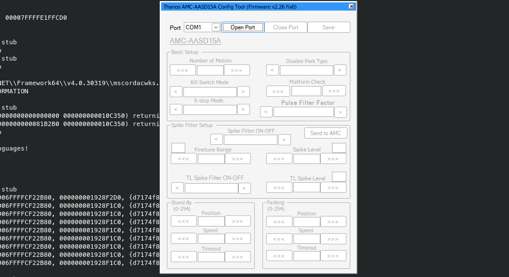

### Trying it in a VM

I was getting desperate, I decided to spin up my Windows VM, install putty, SimHub and AMC_Config and pass the USB device through to them and see if they work. Shocked, they all worked - but it pointed me in a direction.

I tried the "Custom Serial Device" option in SimHub again, in the VM, and there was no such message "max baud rate is 131072", it connected right up. So it's not my controller, it's not SimHub, so it's Wine.

### Reverse Engineering

At this point, I installed Wireshark and grabbed some PCAPs of the USB traffic to analyse and downloaded [`dnSpy`](https://github.com/dnSpyEx/dnSpy) (also running in Wine, btw) and decompiled both `AMC_Config.exe` and `SimHub` to attempt to see what they were doing differently to `putty` and why it would work while both the other utilites wouldn't.

Handily, they are both written in .Net which made the decompiled code very readable without having to employ something more hardcore like [IDA Pro](https://hex-rays.com/ida-pro).

A small excerpt from `AMC_Config.exe` showed me all I wanted to know, it was using the same configuration as I was in `putty` so why on earth wasn't it connecting?

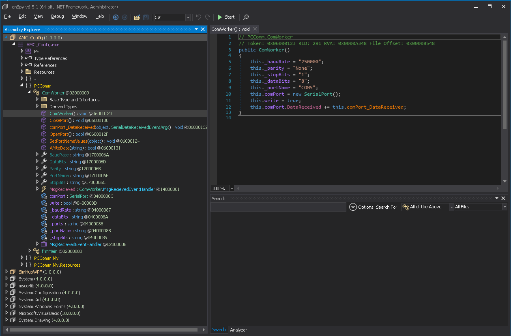

I looked into the `OpenPort` function and it was using the standard .Net API `Serial.Open()` which in turn was inside [`System.IO.Ports`](https://learn.microsoft.com/en-us/dotnet/api/system.io.ports.serialport?view=net-10.0-pp)

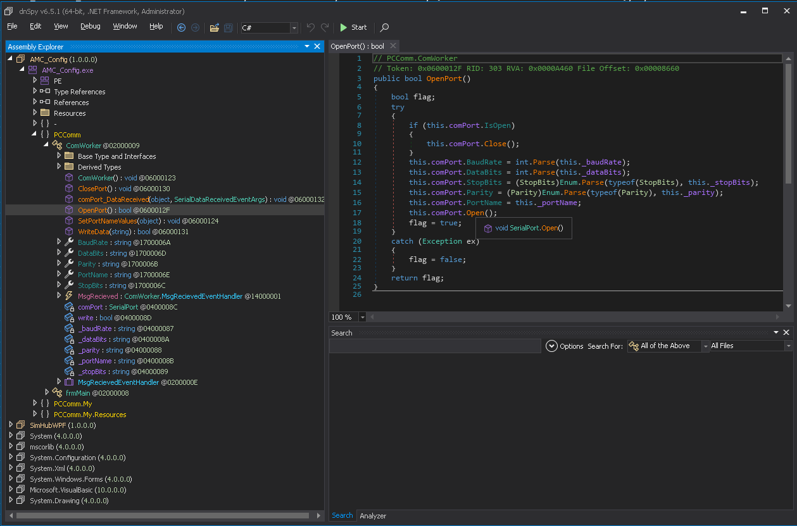

So it's all using standard .Net APIs, nothing funky - but it's still not connecting with the same parameters that I used in the same Wine prefix with `putty`. What gives?

## The Breakthrough

I was remembering back to that really, really weird baud rate I saw in SimHub's Custom Serial module - `131072` - what on earth was that, and could it be related to the problem I was having? After all, my controller needs to run at `250000` baud.

Well, some internet-fu later, I come across [this forum post](https://forum.fs-net.de/index.php?thread/1690-rs232-baud-rates-picocom1/) from a company (who I think make devices and write USB drivers for them), referencing this `131072` number, that can't be a coincidence.

The engineer advises the user to use the `GetCommProperties()` API in to query the COM port's `dwMaxBaud`. They come back saying it reports `131072` for this - which is obviously non-standard.

Well, [`dwMaxBaud` has a range of valid values](https://learn.microsoft.com/en-us/windows/win32/api/winbase/ns-winbase-commprop) - defined in hex. One of the common high-baud rates that is defined is `BAUD_115200` or in their hex representation `0x00020000`.

If you convert `0x00020000` to decimal you get... `131072`. BINGO.

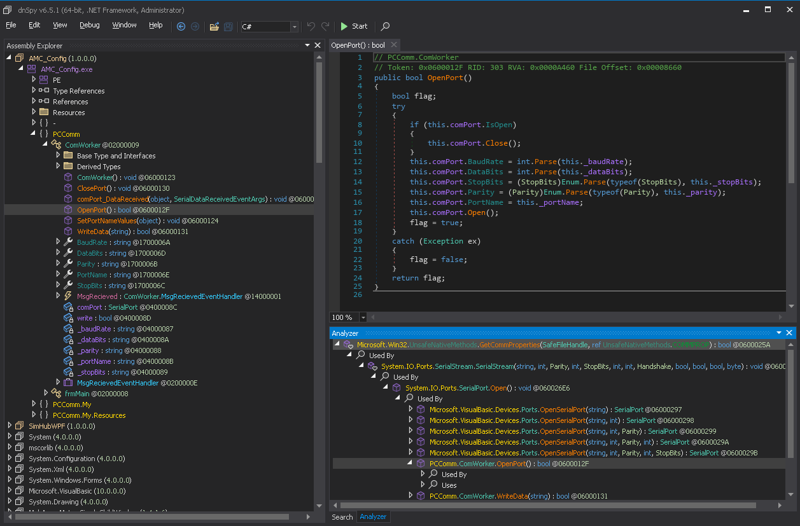

This sent me down the disassembly rabbit hole again, and it turns out that `GetCommProperties()` is referenced by `System.IO.Ports.SerialPort.Open()` which is referenced our app - at this point things are coming together, something in Wine's implementation of `GetCommProperties()` must be capping our baud to `115200`/`hex: 0x00020000` instead of the actual correct value for our device, which would be something they call [`BAUD_USER`](https://learn.microsoft.com/en-us/windows/win32/api/winbase/ns-winbase-commprop) with representation `0x10000000`.

## The Expert

At this point, I'm kind-of in above my pay grade, I can take stuff apart fine, but knowing where and how to fix them is another thing. Right now I'm sitting on the floor surrounded by a completely disassembled mess of information.

Handily, [my brother, Ryan](https://ryanjgray.com/), is a bit of a nerd too. He spends his time reverse engineering games and apps from the early 00's and on weird architectures like MIPS. He's also maintaining a TAA mod for Alien Isolation that's apparently pretty good and has a project to [reverse engineer and build an SDK](https://github.com/OpenIsolation/OpenIsolation) for the game.

I catch him up on what I've tried, what I'm trying to do and he instinctively just goes off and finds some references to that debug log we got from `AMC_Config.exe` a while back: `IOCTL_SERIAL_GET_PROPERTIES`.

He points me to the Wine repo and [in particular a function](https://gitlab.winehq.org/wine/wine/-/blob/master/dlls/ntdll/unix/serial.c#L372) he walked back to from that printout.

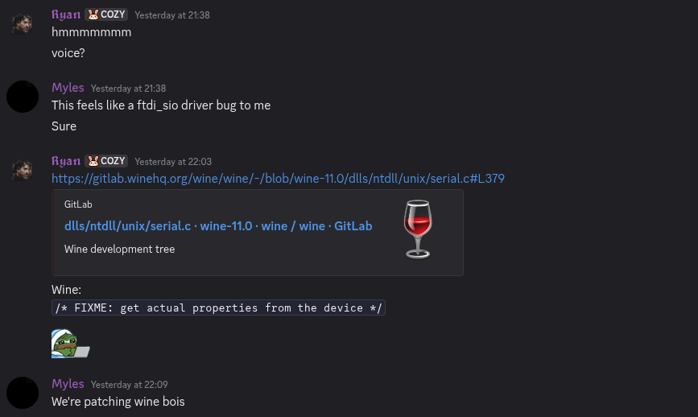

Here was our smoking gun. Not only did we have a `/* FIXME: get actual properties from the device */` for this function, `MaxBaud` was pinned to `BAUD_115200` - so that explains the `131072` we were seeing in the applications using this function running under Wine.

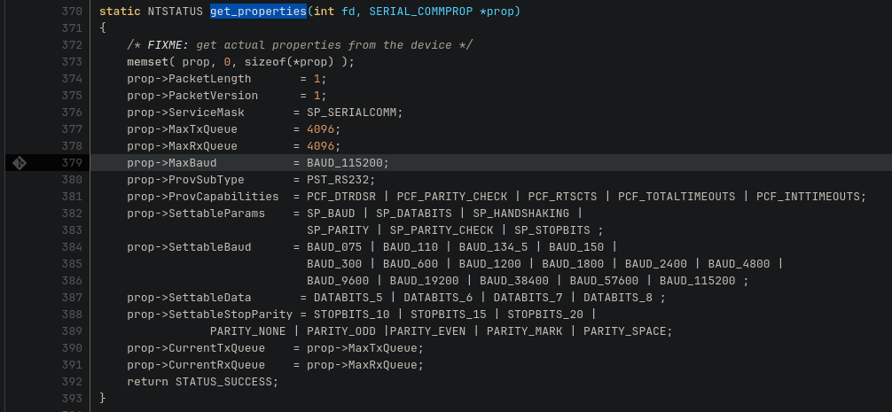

## The Fix

The next step is obvious, clone down the Wine repo, add in the missing `BAUD_USER` to both `MaxBaud` and `SettableBaud`, build and try it out. Handily, it was [already defined in `winbase.h`](https://gitlab.winehq.org/wine/wine/-/blob/master/include/winbase.h#L1125-1146) so I didn't need to add the definition.

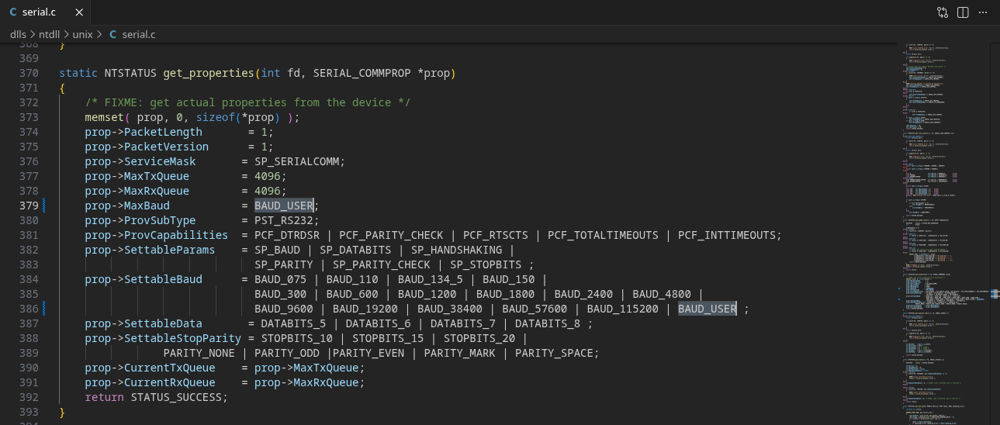

I've played a lot with OSS projects in my day job working on Kubernetes, but basically none are as large as Wine, I was kind of dreading the build process as in my experience it has been hit-or-miss depending on the maintainers.

Thankfully, it was awesome, with a slight tweak to the official build instructions:

```sh
./configure --enable-win64 #to enable the new Wine 11 unified arch stuff
make -j 32 #give the build more cores to run faster
```

A few minutes later we have a new `wine` binary and I can set up a prefix to try out our `AMC_Config.exe` as a proof-of-life.

### GORDON'S ALIVE

```sh
WINEPREFIX=~/.local/share/wineprefixes/wine-serial-testing ./wine ~/Downloads/AMC_Config/AMC_Config.exe 
```

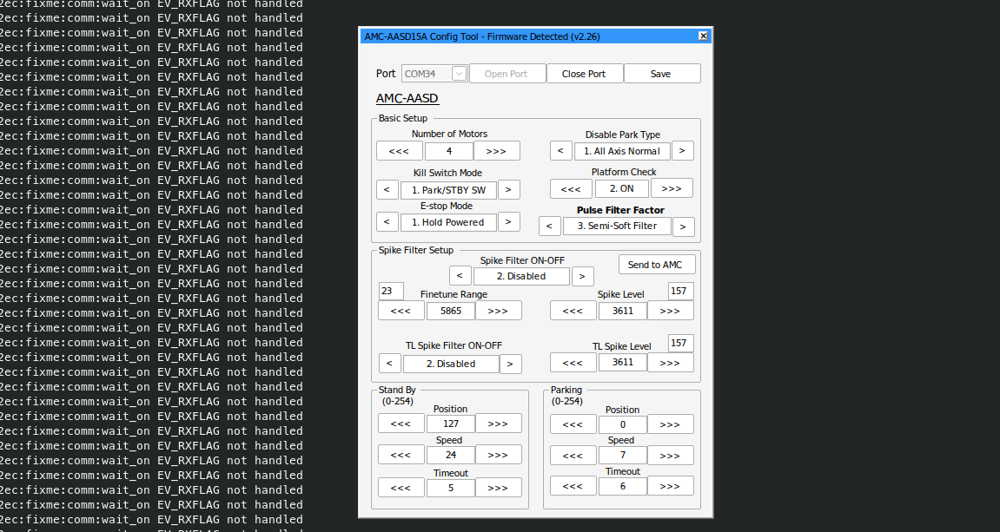

I can edit parameters, hit save and it moves the rig!

### The Real Test

Now, clearly, let's run it in SimHub and see if we can get the rig to do the electric-boogaloo. Firstly, in the Custom Serial module:

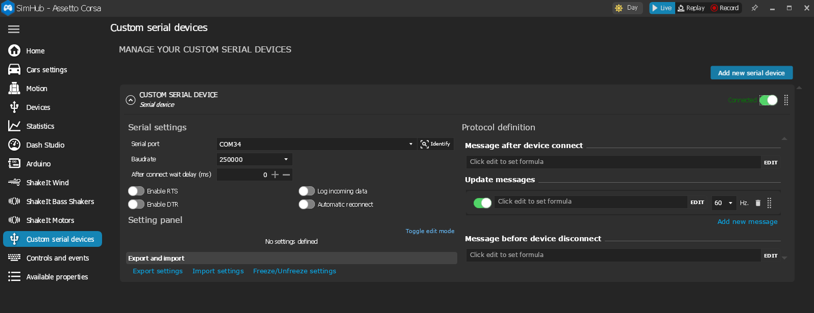

Looking good! Now for the motion section.

[SimHub Motion, still nothing]()

Crap. So SimHub must _still_ be doing some filtering, on VID/PID that isn't passed correctly.

## Round Up

I have seen lots of scattered references to this problem on the [WineDB forums](https://forum.winehq.org/viewtopic.php?p=139497#p139497), and various places where people are hitting `115200` baud limitations in serial devices in Wine, for flashing devices, GPS updates, 3d printers, all sorts - either met with silence or "Wine will figure it out for you". 

Now, at last, Wine will work with baud rates `>115200` hopefully in a release in the not-too-distant future.

I just wished the threads weren't locked so I could tell them it's fixed.


[Now we can (finally) play the game](https://www.youtube.com/watch?v=tg2PD-dwsIw).